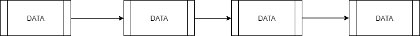
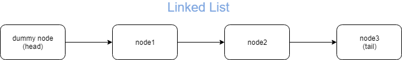
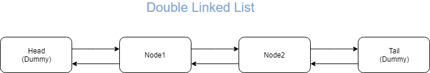
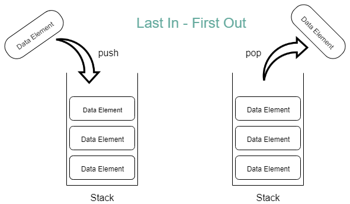
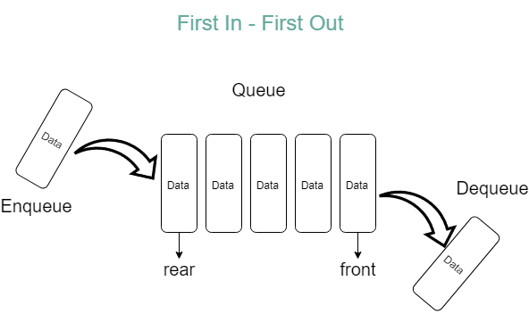
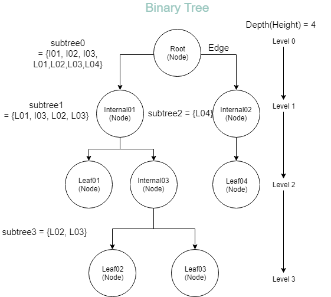
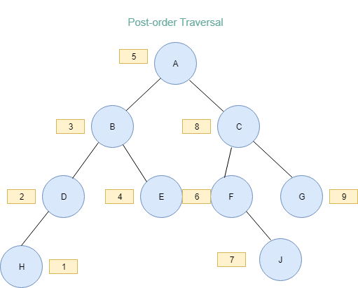
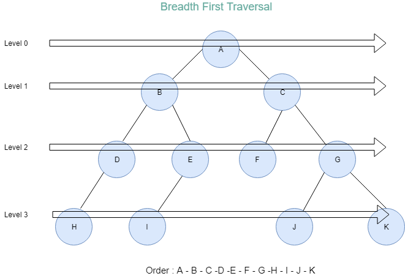
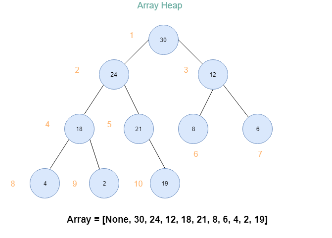

# python data structure

## Reference - https://programmers.co.kr/learn/courses/57

### 1. Linear array

##### https://github.com/NDjust/python_data_structure/tree/master/linear_array

    - insert algorithms 
    - find index algorithms

### 2. Sort and Search

##### https://github.com/NDjust/python_data_structure/tree/master/sort_search

    - bulit in sort method
    - string sort method
### 3. Recursive function

##### https://github.com/NDjust/python_data_structure/tree/master/recursive_function

    - by using recursive implement fibonacci
    - by using recursive implement binary_search algorithms

### 4. Complexity of Algorithms

##### https://github.com/NDjust/python_data_structure/tree/master/complexity_algorithms

    - Time Complexity

    - Space Complexity

    - Average Time Complexity

    - Worst-case Time Complexity

    - Bio-O Notation
    examples)
    > O(logn) - Size and log Proportion of Input : binary search algorithms.
    > O(n) - Size and Proportion of Input : linear search algorithms.
    > O(nlogn) - Merge sort algorithms.
    > O(n2) - insert sort algoritms.

### 5. Linked List

##### https://github.com/NDjust/python_data_structure/tree/master/linked_list

#### Objects

> 1. Node
> 2. LinkedList

#### Linked List Methods

> 1. getAt() - certain element reference 
> 2. traverse() - list traversal
> 3. getLenth()- get lenth
> 4. insertAt(pos, newNode) - insert element
> 5. popAt(pos) - delete element
> 6. concat(L) - merge list to list

### 6. Dummy Linked List

##### https://github.com/NDjust/python_data_structure/tree/master/dummy_LikedList

### 7. Double Linked List

##### https://github.com/NDjust/python_data_structure/tree/master/DoublyLinkedList

### 8. Stack
### Last-in First-Out Data Structure
##### https://github.com/NDjust/python_data_structure/tree/master/Stack

Methods

> 1. push(x) - Insert data element at last index
> 2. pop() - Return & delete data element at last index
> 3. is_Empty() - Check Stack (boolean)
> 4. peek() - Return data element at last index

Stack Application Examples.

1. Convet infix notation to postfix notation

2. Calculate postfix notation

### 9. Queue
### First-in First-Out Data Structure
#### https://github.com/NDjust/python_data_structure/tree/master/queue

Methods

> 1. enqueue(x) - Insert data element at last index 
> 2. dequeue() - Return & delete data element at first index
> 3. is_Empty() - Check Stack (boolean)
> 4. peek() - Return data element at first index
> 5. size() - Check how to many data counts 
> 6. isFull() - Check to data is full

Stack Application Examples.

> 1. CircularQueue
> 2. PriorityQueue

### 10. Binary Tree

#### https://github.com/NDjust/python_data_structure/tree/master/tree

#### Composition of tree

> 1. nodes - edges
> 2. root node - internal node - leaf node
> 3. parents node - child node
> 4. Level of node
> 5. Degree of node
> 6. depth(height) of tree 
> 7. subtrees

#### methods

> size()- node counts

> depth() - depth of tree

> traversal() - tree traversal

#### sort of traversal

1. in-order Traversl

> order : left subtree -> self -> right subtree

2. pre-order traversal

> order : self -> left subtree -> right subtree

3. post-order traversal

> order : left subtree -> right subtree -> self

4. Breadth first traversal

#### Sorts of Binary Tree 
1. binary trees
- Level of all nodes is lower below 2.
- Can define recursive 

2. full binary trees
- Filled with nodes at all level
- Height = k, nodes = 2**k -1 

3. complete binary trees
- Height = k
- Up to level k - 2, all nodes is full binary tree with two children
- At level k - 1, a binary tree with nodes sequentially filled from the left

### 10. Heap
#### https://github.com/NDjust/python_data_structure/tree/master/heap

#### methods
> 1. __init__() - Create empty heap
> 2. insert(item) - Insert new data item
> 3. remove() - Max data(root node) return & remove
> 4. maxHeapify() - Use recursive algorithms to remove data

#### Heap Node pattern
> node number : m
> 1. left child number : 2 * m
> 2. right child number : 2 * m + 1
> 3. parent node number : m /// 2

#### Heap Applications

1. Prioirity Queue
2. Heap Sort